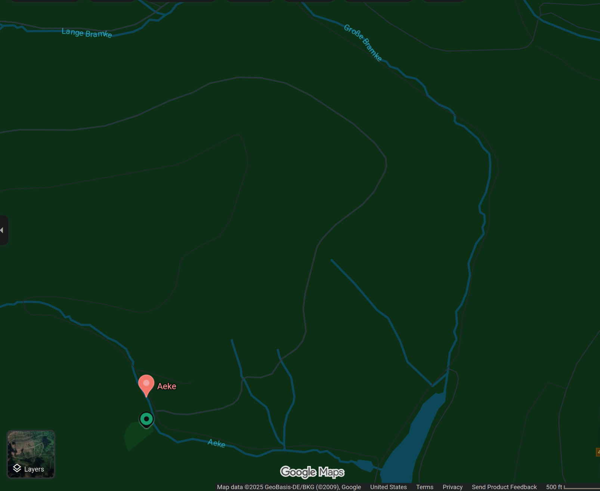
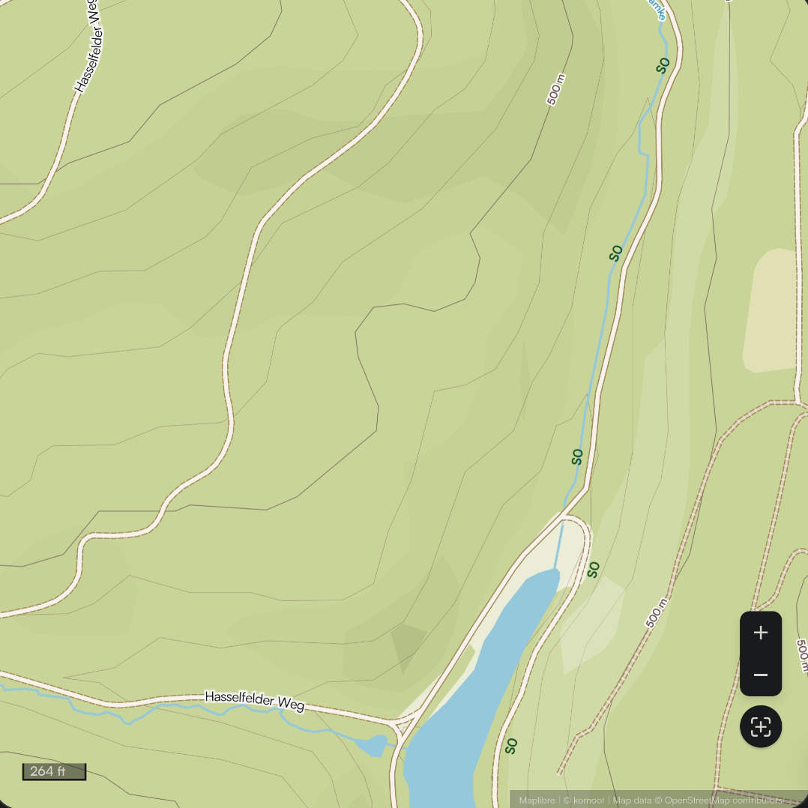
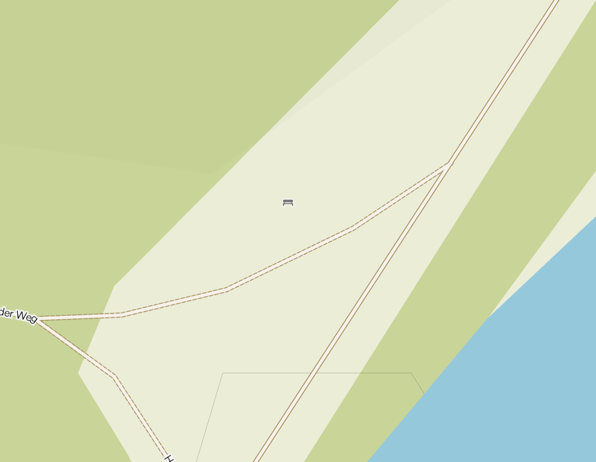

# `Platypwn CTF 2025`: `Bench` 
Author: Walker Dauphin (obsydian)

## Description
>Last year we had a swing, this year it is only a bench where you can sit down and rest a bit from all the challenging challenges. Where was this photo taken?
>Brute force is neither necessary nor allowed to solve this challenge. Do not attack the location picker tool. The tool is rate-limited to three tries per minute, so be careful when you submit. A full-resolution version of the image is available for download.

Files:
*  

## Tools Used
* `google lens` -- reverse image search
* `google maps`
* `gwenview` -- photo viewer/editor

## Initial Steps
I opened the provided PNG file and immediately put it into **google lens**. The initial data I got from google was basically useless. Similar to the [ditch](../ditch/README.md) challenge, google guessed that this was a hiking ground, so I didn't have anything to really go on.

## Solution
After **google lens** failed, I opened up the picture in **gwenview** to look further into what might be going on. Upon opening the picture and zooming in, I saw some interesting things.
* First, there appears to be a rock in the lower left with inscriptions. They read **AEKE** and **BRAMKE** respectively.
* Secondly, next to the bench, there are signs for bikers, so that tells me that there might be further information on **komoot.com** (man that site was useful for this CTF weekend) where bikers or hikers may have pictures of that very spot.

Now nowing about **AEKE** and **BRAMKE**, I looked them up. Initially, I thought maybe they were German cities or much older spellings of modern German townships. However, after searching in **google maps**, I discovered these weren't the names of towns or cities, but of *rivers*!

We use the picture from **google maps** to cross-reference the maps available on komoot.com. Based on the information from google, it's likely we're looking for an area where the **Aeke** and **Bramke** tributaries intersect, and we find this area: 

This picture looks *mighty* close to the reference we have on **google maps**, maybe we should zoom in further to see if there's a rest area...

Well well well, looks like there's a bench icon right on the map, where the **Aeke** and **Bramke** intersect! I think this might be where the original photo was taken! To find the flag, we now have to use the same tool used in the [ditch](../ditch/README.md) challenge and click on the precise point in the map where we believe the photo originated.

After some 4 clicks, we find it!

Our flag is:

`PP{h0p3-y0uR3-f33L1n6-R3fre5HEd::8-I3NiCGE94_}`

