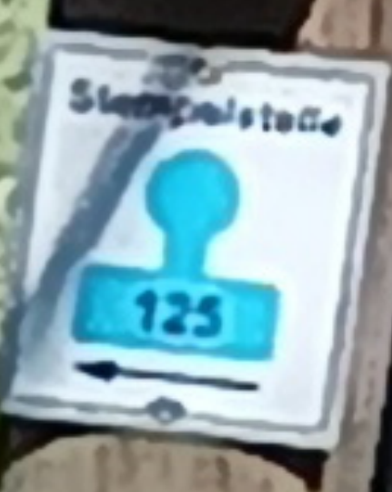
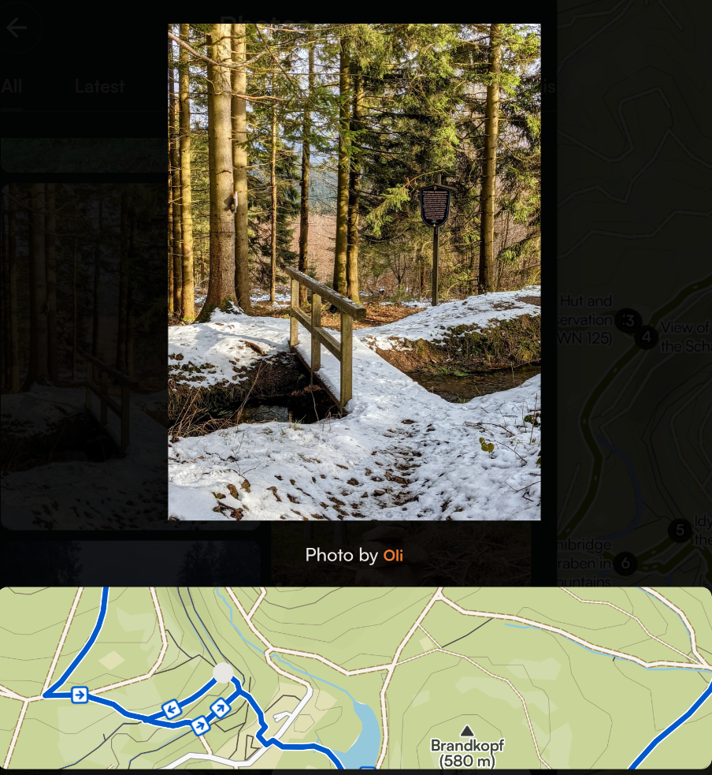
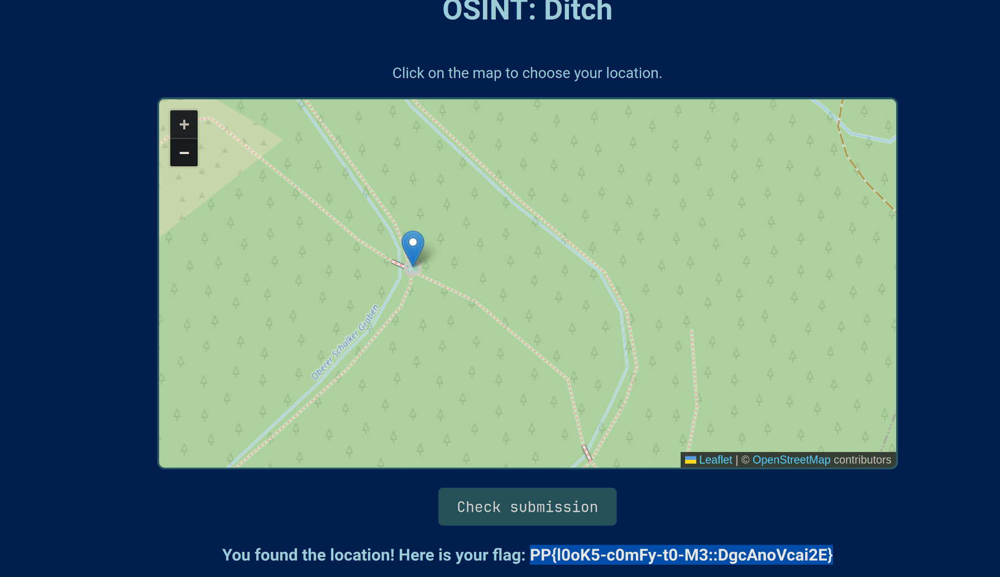

# `Platypwn CTF 2025`: `Ditch` 
Author: Walker Dauphin (obsydian)

## Description
>The challenge author has found a nice ditch, so they took a photo of it including the signpost with its coordinates on. But what is that! A Platypwny has eaten up the coordinates!

>Luckily, you can still find the coordinates again, right?

>Brute force is neither necessary nor allowed to solve this challenge. Do not attack the location picker tool. The tool is rate-limited to three tries per minute, so be careful when you submit. A full-resolution version of the image is available for download. This is not a forensics challenge.

Files:
* 

## Tools Used
* `google lens` -- reverse image search
* `google search`
* `gwenview` -- photo viewer/editor

## Initial Steps
I plugged the provided png file into **google lens** to see what would pop up. The initial result just told me that the picture was taken on a hiking trail. Not enough to go on.

After the first reverse image search, I tried looking into the most obvious information that wasn't obfuscated in the photo, the picture of the blue sign with **125** written on it. To do this, I cropped the original photo using **gwenview** to just focus on the blue sign and try to decipher the writing above the number 

## Solution
After cropping the photo, I plugged it into google lens and focused the search engine on the text, that got me this:

Ok, so we know now that the sign says **Stempelstalle** with 125 underneath. Cool, now we need to find where this "stamp 125" would be administered in the world. So, the next query into google is "stampelstelle 125". After enerting this query into google, we find this [website](https://www.harzer-wandernadel.de/stempelstellen/uebersichtskarte/stempelstelle-125-schalker-turm/)

Ok, so this looks like a hiking trail in the Harzaer Wandernadel National Forest, located in Lower Saxony Germany. We're narrowing down the location of the picture. In fact, the site also gives us the trail name: **Stempelstelle 125 / Schalker Turm**

Since the first challenge I solved ([Mean Kitty](../mean_kitty/README.md)) took me to [komoot](komoot.com), I decided to  poke around, turns out it's like AllTrails, but so much better. For those who don't know, AllTrails is an application/website that details hiking trails around the United States, but in my opinion, komoot is just better (not asking me to sign up or create an account every 2 seconds and custom hiking routes).,

Anyway, I decided to look up this **Schalker Turm** trail on **komoot** and look through the photos to see if there wasn't a clearer picture of the sign shown in the original picture provided in the challenge. In order to see all the pictures, I had to create an account, so I did so with my dedicated spam email account. I plugged **Schalker Turm** into the search on komoot and the first result I got was [this](https://www.komoot.com/discover/View_of_the_Brocken_from_the_Schalker_Tower/@51.8481000,10.3835190/tours?sport=hike&toursThroughHighlight=429801&pageNumber=1).

After scrolling from through the 600+ available photos on the site, it looks like we've found a picture of our spot! Albeit, from a different angle:

We can narrow it down even further on komoot by hovering over the picture and zooming in on the map like so:

Now it's time to submit, the Platypwn website provides a mapping tool on which the user must click the precise coordinates of where the originally provided picture was taken. So, I clicked around in that general area for about 30ish minutes until it submitted.

This provides us with the flag which we can then submit:

`PP{l0ok5-c0mFy-t0-M3::DgcAnoVcai2E}`

#### Extra Notes
I'm going to be honest, I do my writeups after the CTF is over so I don't miss time on flag points while the CTF is running. In reality, finding this was way harder in the moment. I got to komoot and found the original trail sign, unobfuscated. This trail sign had the exact coordinates of the picture and I thought that was the answer, so I tried entering `PP{<lat>,<long>}` at first as an answer but it didn't work. Afterwards, I spent a lot of time on google maps and in the OSINT flag checker tool trying to just guess the location as precisely as I could until I found the answer. This writeup was done *after* the CTF was over and I had the benefit of previous experience to expedite the whole process and streamline it. Either way though, this was a fun challenge and I'm glad to have done it!

