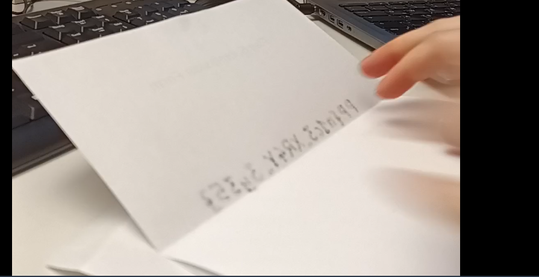

# `Platypwn CTF 2025`: `Flag Submission System` 
Author: Walker Dauphin (obsydian)

## Description
>For this Platypwn, we thought about a new and super secure Flag Submission System! To make it easier for you, we made a tutorial video where you can learn how it works.

Files:
* [flag_submission_system zipfile](./osint.flagsubmissionsystem.zip)

## Tools used
* `vlc` -- media player
* `gwenview` -- photo view/editor

## Initial Steps
After unzipping the provided file, we find an mp4 that can be played with the user's player of choice. I chose **VLC** since it's just the best, no arguments. I watched the video a couple times and was really confused on what to do...

For those that don't want to watch the video, it's a short video (about 10 seconds) in which a user types information on a form, prints out the form, folds the form up on camera, and inserts it into an envelope.

## Solution
After watching the video several times, it finally occured to me that maybe I had missed something that happened really fast. So using **VLC's** speed controls, I watched the video in slow motion. 

After doing so, I found a particular frame in the video worth that was interesting:

I used **gwenview** (the default photo viewer/editor in KDE) to mirror the image to read it easier:

We can see the flag in the mirrored image!

`PP{n1c3_XR4Y_3y35}`

