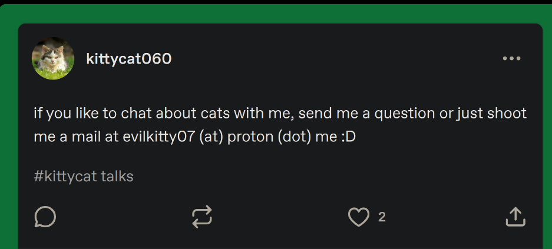
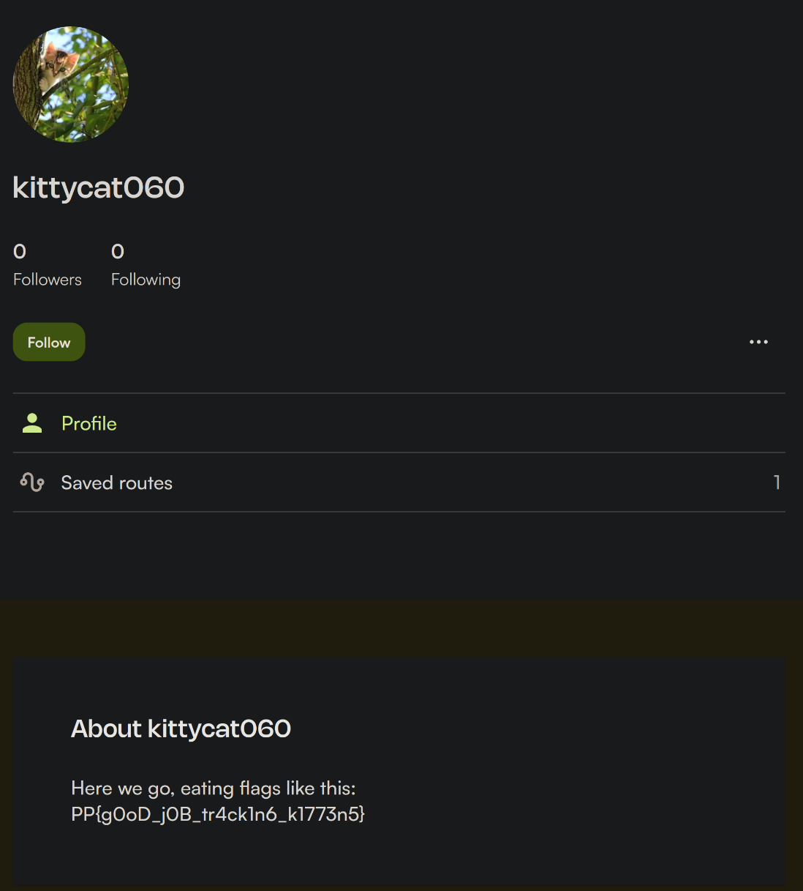

# `Platypwn CTF 2025`: `Mean Kitty` 
Author: Walker Dauphin (obsydian)

## Description
>Anonymous sources have provided us with some mysterious threats towards us. Can you track down the mean kitty and protect our flags?

Files:
* 

## Tools used
* `sherlock` [tool link](https://github.com/sherlock-project/sherlock)-- Check username across sites
* `holehe` [tool link](https://github.com/megadose/holehe) -- Check email registrations across sites

## Initial Steps
I looked at the provided PNG and used **sherlock** to get information on the user.

`sherlock kittycat060`
`sherlock @kittycat060`

This gave me a multitude of accounts, but the most interesting was the tumblr account shown, and that account also matched the PNG provided

## Solution
After finding the user's tumblr account, I looked  at the user's posted photos and found this: 



This tells me that the user has an email address at **evilkitty07@proton.me**

After some googling, I found a tool that would allow me to look at a user's email address and registrations across multiple sites. This tool was **holehe**

```
> holehe evilkitty07@proton.me

***************************
   evilkitty07@proton.me
***************************
[x] facebook.com
[x] about.me
[-] adobe.com
[-] amazon.com
[x] amocrm.com
[-] any.do
[+] archive.org
[-] armurerie-auxerre.com
[x] atlassian.com
[-] axonaut.com
[x] babeshows.co.uk
[x] badeggsonline.com
[x] bios-mods.com
[x] biotechnologyforums.com
[x] bitmoji.com
[x] blablacar.com
[x] blackworldforum.com
[-] blip.fm
[x] forum.blitzortung.org
[x] bluegrassrivals.com
[-] bodybuilding.com
[x] buymeacoffee.com
[x] discussion.cambridge-mt.com
[-] caringbridge.org
[x] chinaphonearena.com
[x] clashfarmer.com
[x] codecademy.com
[x] forum.codeigniter.com
[-] codepen.io
[-] coroflot.com
[x] cpaelites.com
[x] cpahero.com
[x] cracked.to
[!] crevado.com
[!] deliveroo.com
[x] demonforums.net
[-] devrant.com
[x] diigo.com
[x] discord.com
[-] docker.com
[x] dominos.fr
[-] duolingo.com
[x] ebay.com
[x] ello.co
[-] envato.com
[-] eventbrite.com
[!] evernote.com
[-] fanpop.com
[-] firefox.com
[-] flickr.com
[-] freelancer.com
[x] drachenhort.user.stunet.tu-freiberg.de
[x] garmin.com
[!] github.com
[x] google.com
[-] en.gravatar.com
[-] hubspot.com
[x] imgur.com
[-] insightly.com
[x] instagram.com
[x] issuu.com
[x] forum.kodi.tv
[+] komoot.com
[-] laposte.fr
[!] last.fm
[-] lastpass.com
[-] mail.ru
[x] community.mybb.com
[x] myspace.com
[x] nattyornotforum.nattyornot.com
[-] naturabuy.fr
[x] forum.ndemiccreations.com
[x] forums.nextpvr.com
[x] nike.com
[x] nimble.com
[x] nocrm.io
[x] nutshell.com
[x] ok.ru
[-] office365.com
[x] onlinesequencer.net
[-] parler.com
[x] patreon.com
[!] pinterest.com
[x] pipedrive.com
[-] plurk.com
[x] pornhub.com
[+] protonmail.ch / Date, time of the creation 2025-11-10 11:28:41
[x] quora.com
[-] rambler.ru
[x] redtube.com
[-] replit.com
[!] rocketreach.co
[!] samsung.com
[-] seoclerks.com
[-] 7cups.com
[x] smule.com
[!] snapchat.com
[!] soundcloud.com
[-] sporcle.com
[-] spotify.com
[x] strava.com
[x] strava.com
[-] taringa.net
[x] teamleader.eu
[-] teamtreehouse.com
[-] tellonym.me
[x] thecardboard.org
[x] forums.therian-guide.com
[x] thevapingforum.com
[x] tumblr.com
[x] tunefind.com
[-] twitter.com
[x] venmo.com
[x] vivino.com
[x] voxmedia.com
[x] vrbo.com
[x] vsco.co
[-] wattpad.com
[-] wordpress.com
[x] xing.com
[-] xnxx.com
[-] xvideos.com
[-] yahoo.com
[-] zoho.com

[+] Email used, [-] Email not used, [x] Rate limit, [!] Error
123 websites checked in 10.93 seconds
Twitter : @palenath
Github : https://github.com/megadose/holehe
For BTC Donations : 1FHDM49QfZX6pJmhjLE5tB2K6CaTLMZpXZ
100%|███████████████████████████████████████████████████████████████| 123/123 [00:10<00:00, 11.26it/s]
```

After reading the output, we can see that there are two sites besides proton.com that this user is registered to. Those sites are "archive.org" and "komoot.com". Komoot lets us search users by ID, but we don't know evilkitty's ID, let's check their tumblr archive again.

After checking the archive again, we find this: [kitty's id](./kitty_id.png). It would appear that **5398925160033** is the user's komoot ID

Ok, we know the user's komoot id, so let's plug it into the URL:
>https://www.komoot.com/user/5398925160033

This gives us kittycat060's komoot profile, where they've kindly posted the flag for us!



The flag is: `PP{g0oD_j0B_tr4ck1n6_k1773n5}`


